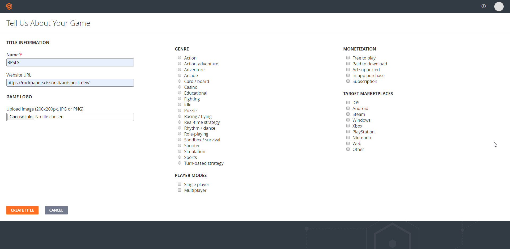
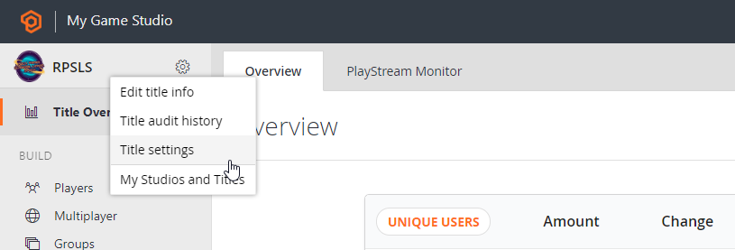
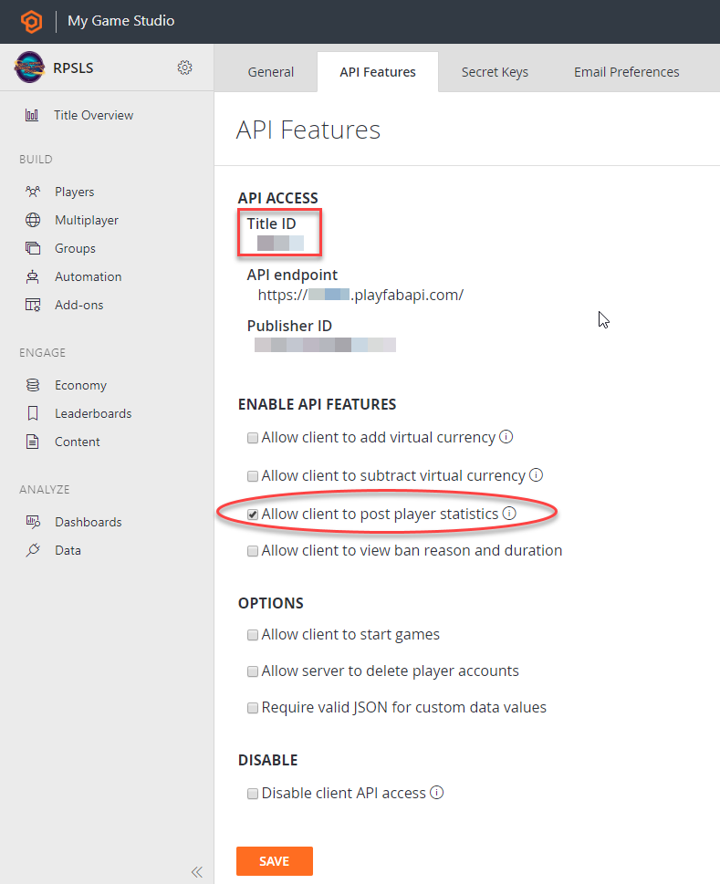
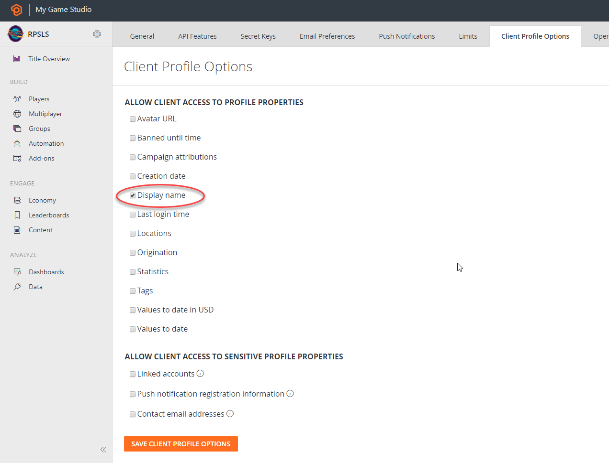

# Rock, Paper, Scissors, Lizard, Spock - Sample Multiplayer Application

Now you can enhance the game to play with a friend with the help of [Playfab platform](https://playfab.com/).
Playfab platform will be used only for the matchmaking queue logic and the leaderboard score.

## Setup
In order to support playfab you will need a platfab account with a game created (title in playfab)

1. Create a new Playfab account in the [sign up page](https://developer.playfab.com/en-us/sign-up) or if you already have one log in with it.
2. With the account creation as developer it creates a Title by default, if not create a new title. We named it RPSLS.

3. Open the title just created and navigate to title settings

4. In the API Features tab select the "Allow client to post player statistics". Required to update leaderboards and matchmaking queues from code.

5. Copy the title Id from _Api features_ tab. Go to Secret Keys tab and copy the Secret key created by default. Both parameters are required for the RPSLS game-api service configuration, we will require them in the Generate-Config.ps1 script or on local development in the docker-compose.override.yml parameters.

6. Make sure that in the "Client Profile Options" tab have the client access "Display Name" allowed. Already checked by default.

The rest of title configurations for the matchmaking queue and the Leaderboard are created directly on code.